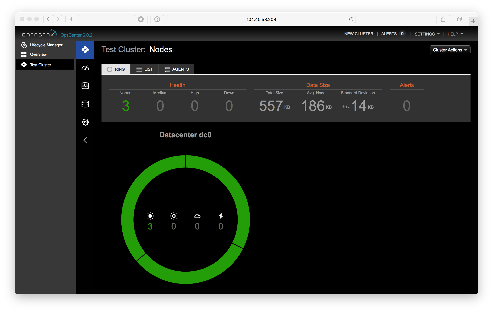
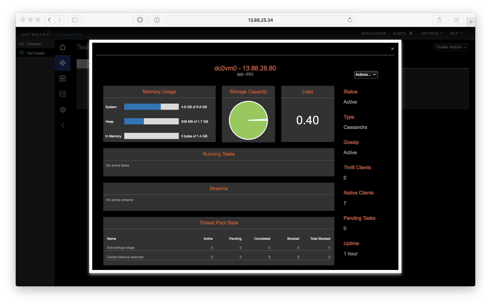
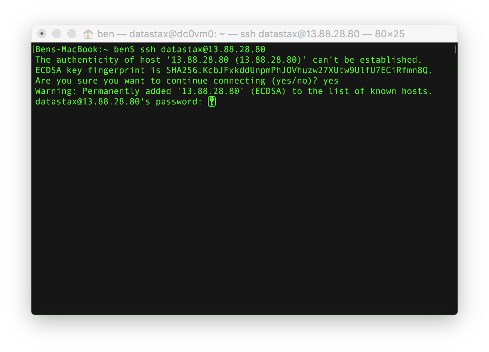
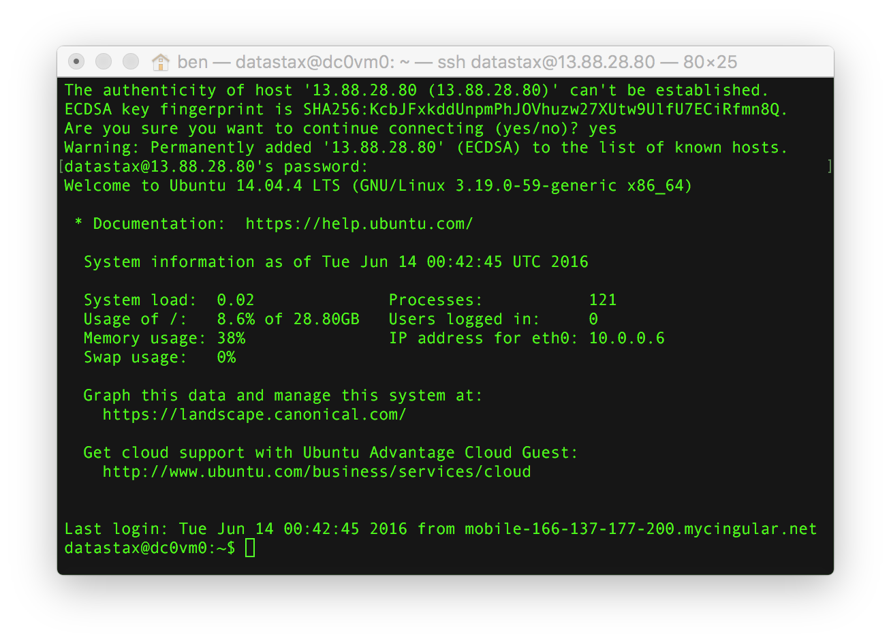
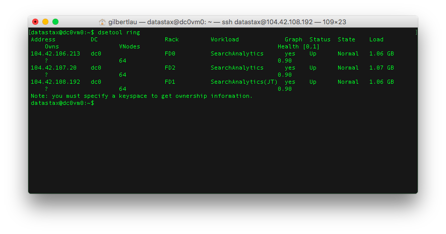
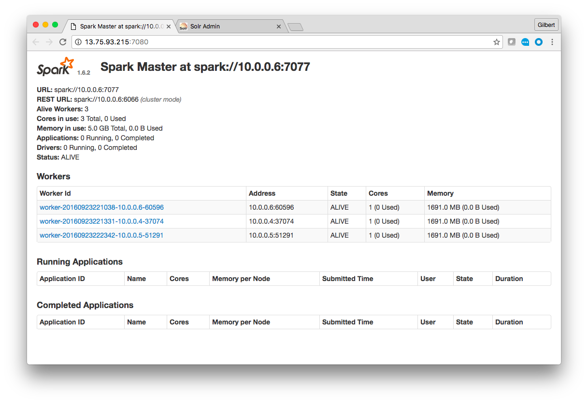
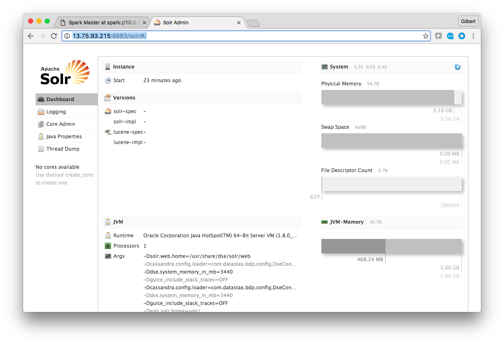

  **[Back to Agenda](./../README.md)**

# Lab 1 - Accessing the Cluster

Open a web browser to your OpsCenter node.
For this cluster, it's running at **http://opscenter_id_address:8888**.   
Find your IP address here: [Cluster IP address](./cluster_ip.md).    



Mouse over the nodes in your ring.  There should be three, with the names node0, node1 and node2.  Click on node0.



We're now going to SSH into each node and modify a configuration file.  You will have to repeat these steps for nodes: node0, node1 and node3. Please refere to the  **[IP list here](./cluster_ip.md).**

If you are on a Mac, you already have SSH installed in your terminal.  If you are on Windows, you may need to install an SSH client.  A popular SSH client is Putty.  Putty can be downloaded from [http://www.putty.org](http://www.putty.org).

For this cluster, the username is root.  So, in the terminal I can ssh to the node by running the command:

```
ssh root@54.186.100.184
```

You may be prompted to accept the node's key.  If so, type "yes" and hit enter.



Enter the password provided in the workshop and hit enter.



Great!

```

dsetool ring

```



Each node should say the words "Search" and "Analytics" and the Graph's column has the value "yes". If any of them don't, you may have to SSH back into that node and ensure the new configuration is set.

Note that one of the nodes says "(SM)"  This is your Spark master.  You can view a webpage with information about Spark jobs by opening a web browser to port 7080 on that node.  For this cluster that is at http://13.75.93.215:7080 .  Note your URL will be different.



We also enabled Solr on our nodes.  You can actually view the Solr UI on any node.  However, for our exercises we're going to use node0.  Open a web browser to port 8983 /solr/ on node0.  For this cluster that is at http://13.75.93.215:8983/solr .  The URL will be different for your cluster.



Great!  You've now logged into the administrative tool, OpsCenter, on your cluster.  You've also used SSH to connect to each database node in your cluster and used that to turn Spark and Solr on.  Finally you've logged into the administrative interfaces for both Spark and Solr.  Next up we're going to start putting data in the database!

## Optional Exercise

OpsCenter 6 introduced Lifecycle Manager (LCM).  Add the cluster to LCM and then review the settings.  It's possible to enable/disable Spark and Solr in LCM.

  **[Back to Agenda](./../README.md)**
