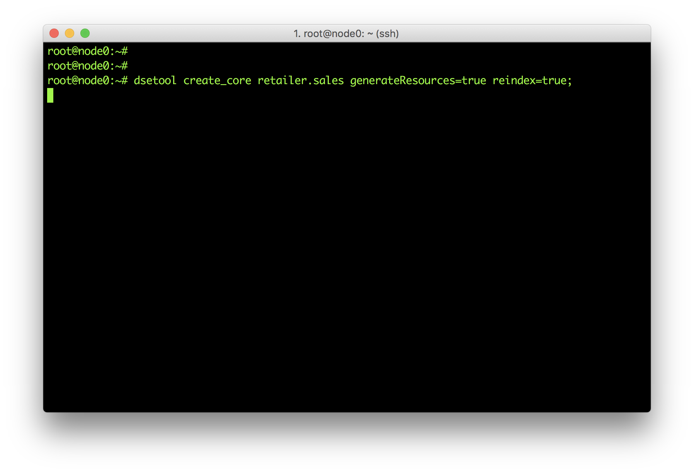
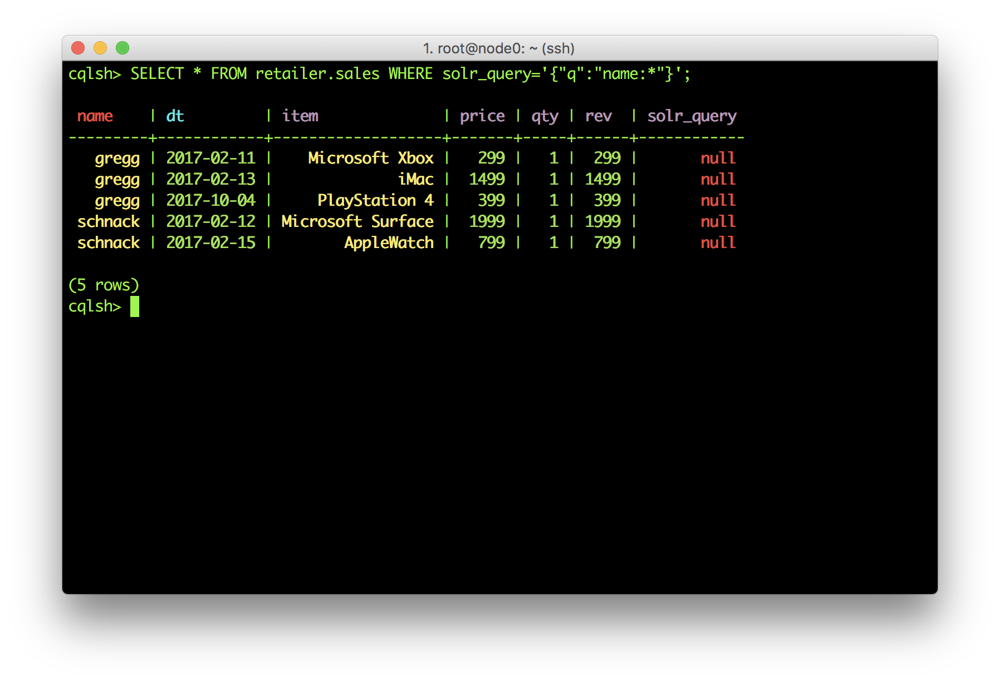
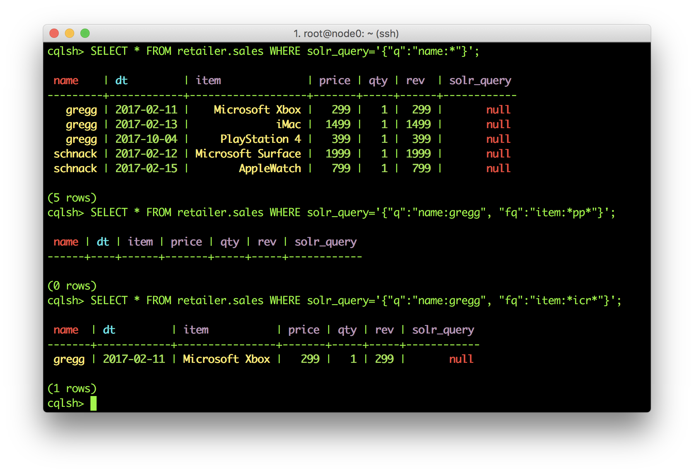

**[Back to Agenda](./../README.md)**


# Lab 5 - Search

## Search Essentials

DSE Search is awesome. You can configure which columns of which Cassandra tables you'd like indexed in Lucene format to make extended searches more efficient while enabling features such as text search and geospatial search.

Let's start off by indexing the tables we've already made. Here's where the dsetool really comes in handy.  From the command line on one of your nodes run:

```
dsetool create_core retailer.sales generateResources=true reindex=true
```



If you've ever created your own Solr cluster, you know you need to create the core and upload a schema and config.xml. That generateResources tag does that for you. For production use, you'll want to take the resources and edit them to your needs but it does save you a few steps.

Now for that description of the dsetool. Use the dsetool utility for creating system keys, encrypting sensitive configuration, and performing Cassandra File System (CFS) and Hadoop-related tasks, such as checking the CFS, and listing node subranges of data in a keyspace.

This by default will map Cassandra types to Solr types for you. Anyone familiar with Solr knows that there's a REST API for querying data. In DSE Search, we embed that into CQL so you can take advantage of all the goodness CQL brings. Let's give it a shot.  Inside a cqlsh run the command:

```
SELECT * FROM retailer.sales WHERE solr_query='{"q":"name:*"}';
```



```
SELECT * FROM retailer.sales WHERE solr_query='{"q":"name:gregg", "fq":"item:*icrosof*"}';
```



For your reference, here's the doc that shows some of things you can do: http://docs.datastax.com/en/latest-dse/datastax_enterprise/srch/queriesCql.html

## Retail Book Workshop

There are some Linux and Cassandra pre-requisites need for this exercise.
* development tools like gcc compiler, Python libraries
* Pip Python - package manager
* DataStax Python Driver

NOTE : All python dependancies are already installed on DataStax Days clusters.

You can check if they're already installed using a package manager e.g. on Ubuntu:
```
apt-cache policy gcc python-dev python-pip python-dev build-essential
```
If any of the packages are not installed, follow the instructions below. If you're sharing a cluster with other students you should decide between you who will perform these tasks on which nodes!

**Install pip and dependencies**

```
sudo apt-get install gcc python-dev
sudo apt-get install python-pip python-dev build-essential
sudo pip install --upgrade pip
sudo pip install --upgrade virtualenv
```

**Install the Python Cassandra Driver**

The next step is to install the DataStax Cassandra Python Driver.

You can check if its already installed using the following command:
```
pip show cassandra-driver
---
Name: cassandra-driver
Version: 3.4.1
Location: /usr/local/lib/python2.7/dist-packages
Requires: six, futures
```
If it *isn't* already installed, use the following command to install it:

>This might take some time on less powerful machines

```

sudo pip install cassandra-driver
```

Now we need to load the data and create our Solr cores.

**Run solr_dataloader.py**

```

git clone https://github.com/norim/DataStaxDay
cd DataStaxDay/data

```

This will create the CQL schemas and load the data. Be sure to pass the name of your keyspace as a parameter:

```
./create_data.sh <name of your keyspace>
...
Loading into Keyspace ...
loading geo
loading meta
Finished!
```

**Run create_core.sh**

This will generate Solr cores and index the data. Be sure to pass the name of your keyspace as a parameter:
```
./create_core.sh <name of your keyspace>
...
Creating Solr cores...
finished creating Solr cores!
```


Here's an example page of what's in the database now:   
 https://www.amazon.com/Science-Closer-Look-Grade-6/dp/0022841393?ie=UTF8&keywords=0022841393&qid=1454964627&ref_=sr_1_1&sr=8-1

Now that we've prepared all that, what can we do?  Lots of things it turns out...

## Filter queries

These are awesome because the result set gets cached in memory.

```
SELECT asin, title, categories, price  FROM retailer.metadata WHERE solr_query='{"q":"title:Noir~", "fq":"categories:Books", "sort":"title asc", "useFieldCache":true}' limit 10;
```


The Amazon data model includes the following tables:


Click stream data:
```
CREATE TABLE <your keyspace name>.clicks (
    asin text,
    seq timeuuid,
    user uuid,
    area_code text,
    city text,
    country text,
    ip text,
    loc_id text,
    location text,
    location_0_coordinate double,
    location_1_coordinate double,
    metro_code text,
    postal_code text,
    region text,
    solr_query text,
    PRIMARY KEY (asin, seq, user)
) WITH CLUSTERING ORDER BY (seq DESC, user ASC);
```
And book metadata:

```
CREATE TABLE <your keyspace name>.metadata (
    asin text PRIMARY KEY,
    also_bought set<text>,
    buy_after_viewing set<text>,
    categories set<text>,
    imurl text,
    price double,
    solr_query text,
    title text
);
```

So what are things you can do?

First, set our ***default*** keyspace so that we dont need to type it in every time.

```
use <yourkeyspace>;
```

**Filter queries**: These are awesome because the result set gets cached in memory.
```
SELECT asin, title, categories, price  FROM retailer.metadata  WHERE solr_query='{"q":"title:Noir~", "fq":"categories:Books", "sort":"title asc", "useFieldCache":true}' limit 10;
```

**Faceting**: Get counts of fields
```
SELECT asin, title, categories, price  FROM retailer.metadata  WHERE solr_query='{"q":"title:Noir~", "facet":{"field":"categories"} , "useFieldCache":true}' limit 10;
```

**Geospatial Searches**: Supports box and radius
```
SELECT asin, user, city, country, location, region, postal_code FROM retailer.clicks WHERE solr_query='{"q":"asin:*", "fq":"+{!geofilt pt=\"37.7484,-122.4156\" sfield=location d=3}", "useFieldCache":true}' limit 10;
```

**Joins**: Not your relational joins. These queries 'borrow' indexes from other tables to add filter logic. These are fast!
```
SELECT asin, title, categories, price   FROM retailer.metadata  WHERE solr_query='{"q":"*:*", "fq":"{!join from=asin to=asin force=true fromIndex=retailer.clicks}area_code:415", "useFieldCache":true}' limit 10;
```

**Fun all in one**
```
SELECT asin, title, categories, price   FROM retailer.metadata WHERE solr_query='{"q":"*:*", "facet":{"field":"categories"}, "fq":"{!join from=asin to=asin force=true fromIndex=retailer.clicks}area_code:415"}' limit 5;
```

Want to see a really cool example of a live DSE Search app? Check out [KillrVideo](http://www.killrvideo.com/) and its [Git](https://github.com/luketillman/killrvideo-csharp) to see it in action.

**[Back to Agenda](./../README.md)**
